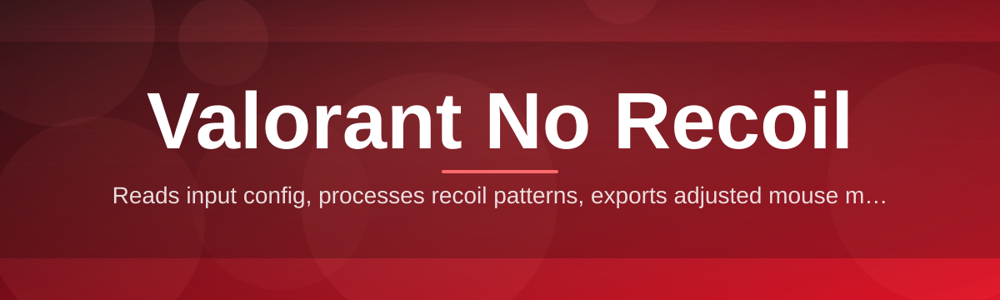
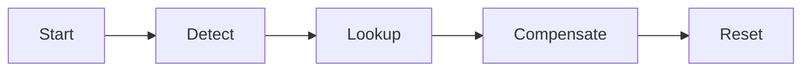

# valorant-no-recoil-controller 🎯🛰️

  

*Precision spray control for Valorant, engineered for consistency and calm crosshair discipline.*

  

## 🧭 Overview

`valorant-no-recoil-controller` is a lightweight Windows companion utility built to counteract per-weapon vertical and horizontal recoil patterns in Valorant. Instead of forcing you to memorize spray curves by muscle memory alone, the controller applies calibrated micro-compensation while you hold fire, so your spray lands closer to where you aimed at bullet one. It's a reference-grade tool for players who care about spray control fundamentals — the kind of thing you'd expect from a project that treats recoil compensation as an engineering problem, not a mystery.

The project exists because Valorant's weapon recoil tables are precise, repeatable, and per-gun — which means they're also *solvable*. Rather than shipping a black-box binary, this repo documents every setting, every profile, and every keybind so the community can audit behavior, tune it to their sensitivity, and extend it with new weapon profiles as the game evolves through 2026's balance patches.

Who it's for: competitive and casual players who want steadier vertical recoil control on rifles like Vandal and Phantom, cleaner horizontal drift management on SMGs, and a UI that gets out of the way. It's not a substitute for game sense, positioning, or utility usage — it's a spray-consistency layer that sits underneath your own aim.

---

## ⚙️ What It Actually Does

> [!NOTE]
> Every capability below ships in the current build. Nothing here is roadmap vaporware.

- **Per-weapon recoil profiles** — Vandal, Phantom, Spectre, Vandal-adjacent rifles, and SMGs each get independently tuned vertical/horizontal compensation curves rather than one generic flat offset.

- **Adjustable compensation strength** — A single sensitivity-linked multiplier scales compensation to match your in-game DPI and sens, so the curve doesn't overcorrect on low sens setups.

- **Toggle & hold input modes** — Bind activation to a toggle key or a hold-to-arm key; both coexist so you can hot-swap style mid-session.

- **Live profile switching** — Swap weapon profiles without restarting the app, using number-row shortcuts mapped to weapon slots.

- **Low-footprint background process** — Runs as a minimal background service with negligible CPU draw, so it won't compete with Valorant for frame budget.

- **Config import/export** — Save your tuned profile as a shareable file, hand it to a teammate, or version it alongside your settings backups.

- **Session overlay HUD** — A minimal on-screen indicator shows active profile and status without cluttering your peripheral vision.

- **Theming** — Light, dark, and a high-contrast "competitive" theme for streaming setups.

<strong>📊 Weapon Profile Reference Table</strong>

| Weapon | Recoil Type | Default Compensation | Recommended Sens Range |
|---|---|---|---|
| Vandal | Vertical-dominant | High | 0.3 – 0.5 |
| Phantom | Vertical + slight drift | Medium-High | 0.3 – 0.5 |
| Spectre | Vertical, tight pattern | Medium | 0.35 – 0.6 |
| Stinger | Horizontal-dominant | Medium | 0.4 – 0.6 |
| Ares | Vertical, sustained | High | 0.25 – 0.45 |
| Odin | Vertical, heavy sustained | Very High | 0.2 – 0.4 |

> [!TIP]
> Start with the default profile for your primary weapon, then nudge the multiplier in 5% increments until your spray lands flat on a stationary range target.

---

## 🚀 How to Get Started

1. Visit the project landing page via the download button above or below.

2. Download the latest build — it's a standalone executable, no installer wizard, no bundled bloat.

3. Run the executable. Windows SmartScreen may prompt on first launch since the binary is community-signed rather than commercially certified — click "More info" → "Run anyway."

4. Launch Valorant, load into a Range or match, and press the default arm key to activate compensation.

> [!IMPORTANT]
> Run the controller *before* Valorant fully loads into a match for the input hook to attach cleanly. Launching it mid-match can cause a one-frame input delay on first activation.

---

## 🖥️ System Requirements

  

- Windows 10 (64-bit) or Windows 11 — no other OS is supported.

- No external runtime dependencies — the executable is fully self-contained.

- No admin privileges required for standard use; some anti-cheat interactions may prompt elevation.

- Minimum 100 MB free disk space, negligible RAM footprint (~40 MB idle).

- A physical mouse. Trackpads and stylus input are not supported input devices for compensation math.

---

## 🧩 How It Works

The controller operates as a thin input-layer companion — it never touches Valorant's game files, memory, or process space. Here's the flow:

1. **Detection** — the app identifies which weapon is currently equipped via your configured profile selection (manual or automatic slot-sync).

2. **Curve lookup** — the matching recoil compensation curve is pulled from the active profile.

3. **Input compensation** — while fire is held, the tool injects small counter-movements at the OS input level, timed to the weapon's fire rate.

4. **Continuous adjustment** — compensation scales dynamically as spray progresses, since recoil curves aren't linear — early bullets need less correction than sustained fire.

5. **Release & reset** — releasing fire resets the curve state instantly, so your next burst starts clean.

> [!NOTE]
> Compensation math runs entirely client-side, locally, with no network calls — your settings and profiles never leave your machine.

---

## 🛟 Troubleshooting

<strong>Compensation feels too strong / weak on Vandal</strong>

Adjust the per-weapon multiplier in Settings → Profiles → Vandal. Most users land between 0.35 and 0.45 depending on in-game sensitivity and DPI.

<strong>The app doesn't seem to activate at all</strong>

Confirm the arm key isn't conflicting with a bind already used inside Valorant's keybind menu. Also check that the app is running with matching privilege level to the game client (both elevated, or both standard).

<strong>Windows SmartScreen blocks the executable</strong>

This is expected for community-distributed binaries without an EV certificate. Click "More info" → "Run anyway" from the landing page download.

<strong>Overlay HUD isn't visible in fullscreen mode</strong>

Switch Valorant's display mode to Borderless Fullscreen — true Fullscreen Exclusive can block overlay rendering on some GPU drivers.

<strong>Profile switching lags by a second</strong>

This is intentional debounce to prevent accidental double-switches from rapid key taps; it can be shortened in Settings → Input → Switch Delay.

> [!WARNING]
> Always download from the official landing page linked in this README. Third-party mirrors are not maintained by this project and may ship stale or altered builds.

---

## 🎛️ UI, UX & Shortcuts

| Action | Default Key | Notes |
|---|---|---|
| Arm / Disarm compensation | `Caps Lock` | Toggle mode by default |
| Hold-to-arm alternate | `Mouse 5` | Runs alongside toggle |
| Switch to profile 1–6 | `1`–`6` | Maps to weapon slots |
| Open settings panel | `Ctrl+Shift+O` | Overlay-safe hotkey |
| Cycle theme | `Ctrl+Shift+T` | Light / Dark / Competitive |
| Export current profile | `Ctrl+E` | Saves to `profiles/` folder |

- **Themes** — Light, Dark, and Competitive (high-contrast, stream-safe colors).

- **Overlay HUD** — repositionable, resizable, and can be fully hidden via `Ctrl+Shift+H`.

- **Settings persistence** — all changes autosave; no manual "Save" step needed.

---

## 🤝 Contributing & Community

> [!TIP]
> New weapon balance patches often shift recoil curves slightly — profile contributions that reflect the latest patch data are always welcome.

- Open an issue for bugs, curve inaccuracies, or feature requests.

- Submit a pull request with new or refined weapon profiles — include your testing methodology (range vs. live match data).

- Discussion threads are open for sensitivity/DPI compatibility reports across different mice and pad sizes.

- Please keep profile submissions weapon-accurate and avoid speculative curves without in-game verification.

---

## 📄 License

Released under the [MIT License](LICENSE), 2026. Free to use, modify, and redistribute with attribution.

---

## ⚠️ Disclaimer

This project is an independent, community-maintained tool and is not affiliated with, endorsed by, or sponsored by Riot Games. Valorant is a trademark of Riot Games, Inc. Use of any third-party software alongside Valorant carries inherent account risk under Riot's Terms of Service — evaluate that risk yourself before use. This tool is provided "as is," without warranty of any kind, express or implied.

